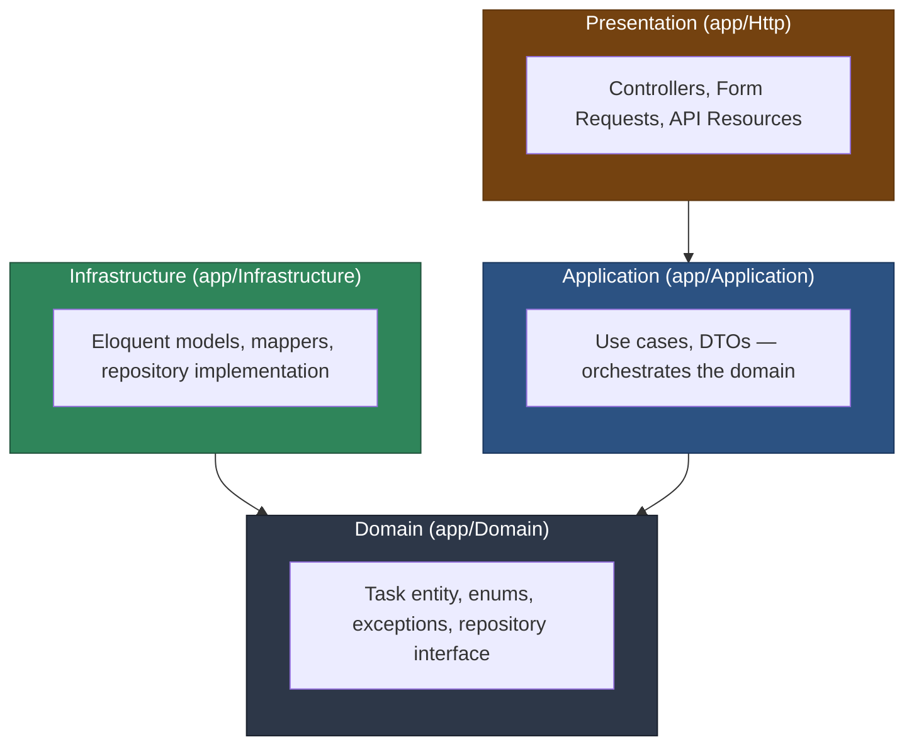

# Task Management API

A Laravel 11 API built to showcase **Clean Architecture** in a PHP codebase: a framework-agnostic domain and application layer, with Eloquent, auth, queues, and HTTP all pushed out to the edges as implementation details.

This repository is not meant to showcase a feature-rich product — it is meant to showcase how the code is organized, tested, and verified. The business logic (`app/Domain`, `app/Application`) has zero dependency on Laravel or Eloquent and is covered by tests that never touch a database. Every feature below — subtasks, tags, auth, rate limiting, idempotency, domain events, live API docs, and the dashboard — was added without breaking that rule.

## Table of contents

- [Architecture](#architecture)
- [Features](#features)
- [Tech stack](#tech-stack)
- [Getting started](#getting-started)
- [Dashboard](#dashboard)
- [API endpoints](#api-endpoints)
- [Authentication](#authentication)
- [Rate limiting](#rate-limiting)
- [Idempotency](#idempotency)
- [Domain events & the queue](#domain-events--the-queue)
- [Live API documentation](#live-api-documentation)
- [Testing strategy](#testing-strategy)
- [CI/CD pipeline](#cicd-pipeline)
- [Project structure](#project-structure)
- [Known limitations](#known-limitations)

## Architecture

The codebase is split into four layers, each with a single, narrow responsibility. The dependency rule is strict: **an inner layer never depends on an outer layer**. Dependencies always point inward, toward the domain.



Read as plain ASCII, the dependency rule looks like this:

```
Presentation  ──depends on──▶  Application  ──depends on──▶  Domain
Infrastructure ──depends on──▶ Domain
```

Notice that **Domain depends on nothing**. It has no `use Illuminate\...` statement anywhere. Infrastructure depends on Domain only through the `TaskRepositoryInterface` contract — it implements it, it doesn't define it.

### The four layers

| Layer | Path | Responsibility |
|---|---|---|
| **Domain** | `app/Domain/Task` | The `Task` entity (plain PHP, not Eloquent) and its business rules, the `TaskStatus` enum, domain exceptions, and the `TaskRepositoryInterface` contract. This is pure PHP — it could be extracted into its own package without touching a line. |
| **Application** | `app/Application/Task` | Use cases (`CreateTask`, `ListTasks`, `FindTask`, `UpdateTask`, `CompleteTask`, `DeleteTask`) and their DTOs. Each use case is a single invokable class that depends only on `TaskRepositoryInterface` — never on Eloquent. |
| **Infrastructure** | `app/Infrastructure/Persistence/Eloquent` | The actual persistence: `EloquentTask` model, `TaskMapper` (translates between the Eloquent model and the domain `Task` entity), and `EloquentTaskRepository`, which implements `TaskRepositoryInterface`. |
| **Presentation** | `app/Http` | Thin API controllers, Form Requests for input validation, and an API Resource for output shaping. Controllers only inject use cases — they never reference Eloquent. |

The binding between the domain contract and its Eloquent implementation lives in `App\Providers\DomainServiceProvider`, registered in `bootstrap/providers.php`:

```php
$this->app->bind(TaskRepositoryInterface::class, EloquentTaskRepository::class);
```

Swapping persistence (an in-memory store for tests, a different ORM, a remote API) means writing a new class that implements `TaskRepositoryInterface` and changing one line in that provider. Nothing in `Domain` or `Application` would need to change.

### Why this matters in practice

- **The domain entity validates itself.** `Task::create()` and `Task::update()` reject an empty title, a title over 255 characters, and a due date in the past — regardless of which layer called them.
- **Domain exceptions carry HTTP semantics without knowing about HTTP.** `TaskNotFoundException`, `TaskAlreadyCompletedException`, and `InvalidTaskDataException` all extend `\DomainException` and are mapped to 404 / 409 / 422 in a single place — `bootstrap/app.php` — instead of scattered `abort()` calls through the controllers.
- **Use cases are trivially unit-testable.** They depend on an interface, so tests exercise them against a hand-written in-memory repository instead of a database. See [Testing strategy](#testing-strategy).

Two cross-cutting concerns follow the same pattern as persistence: domain **events** are dispatched through `EventDispatcherInterface` (an `Application` contract), implemented by `LaravelEventDispatcher` in `Infrastructure` — the domain knows a `TaskCompleted` event happened, never that Laravel's event bus exists.

## Features

Beyond the original `Task` CRUD, the domain was deepened rather than widened — everything below still lives inside the same `Task` story instead of a new bounded context per feature:

- **Subtasks** — a `Task` owns a `list<Subtask>`; completing the parent is blocked while any subtask is still pending (`TaskHasPendingSubtasksException`).
- **Tags** — a lightweight many-to-many relationship, attached/detached per task, find-or-created by name.
- **Authentication** — Laravel Sanctum in both modes: bearer tokens for API clients, and a stateful cookie session for the first-party dashboard, behind the same `auth:sanctum` guard.
- **Rate limiting** — named limiters (`login`, `api`) instead of raw `throttle:N,M` strings, so the policy is readable and testable in one place (`AppServiceProvider`).
- **Idempotency keys** — an `Idempotency-Key` header on `POST /api/tasks` makes retries safe: a repeated key with the same body replays the stored response instead of creating a duplicate task.
- **Domain events + an async queue** — completing a task dispatches a `TaskCompleted` event; a queued listener (`LogTaskCompletion`) records it to an activity log without blocking the request.
- **Live OpenAPI docs** — generated from the actual routes, Form Requests, and Resources by [Scramble](https://scramble.dedoc.co), not hand-maintained.
- **An interactive dashboard** — a Blade + Alpine.js frontend for people who would rather click than `curl`. See [Dashboard](#dashboard).

## Tech stack

- **PHP 8.2+** / **Laravel 11**
- **Laravel Sanctum** for token and SPA-session authentication
- **Alpine.js** + a purged **Tailwind CSS** build, vendored locally (no CDN, no build step) for the dashboard
- **dedoc/scramble** for live, route-derived OpenAPI documentation
- **Pest 3** (`pestphp/pest`, `pestphp/pest-plugin-laravel`) for all testing
- **Larastan / PHPStan** at level 8 for static analysis
- **Laravel Pint** (Laravel preset) for code style
- **SQLite** (`:memory:`) as the test database
- **GitHub Actions** for CI (lint, static analysis, tests with coverage, security)

## Getting started

```bash
git clone https://github.com/WashingtonSteve/projeto-tjsara.git
cd projeto-tjsara

composer install

cp .env.example .env
php artisan key:generate

touch database/database.sqlite
php artisan migrate --seed

php artisan serve
```

`--seed` creates a demo user (`demo@example.com` / `password`) used by the dashboard login and by `tests/Feature/SessionTest.php`.

Domain events are queued, so a worker needs to run for the activity feed to update (set `QUEUE_CONNECTION=database` in `.env`, which is the default outside of tests):

```bash
php artisan queue:work
```

The API is now available at `http://localhost:8000/api/tasks`, the dashboard at `http://localhost:8000/dashboard`, and the live API docs at `http://localhost:8000/docs/api`.

### Quick smoke test

```bash
# Get a token
curl -X POST http://localhost:8000/api/auth/token \
  -H "Content-Type: application/json" \
  -d '{"email": "demo@example.com", "password": "password"}'

# Create a task with it
curl -X POST http://localhost:8000/api/tasks \
  -H "Content-Type: application/json" \
  -H "Authorization: Bearer <token-from-above>" \
  -d '{"title": "Review pull requests", "due_date": "2026-12-01"}'
```

## Dashboard

A small Blade + Alpine.js SPA-like dashboard at `/dashboard`, built for a non-technical audience who would rather click through the product than read `curl` commands. It covers the full feature set from the browser: creating, completing, and deleting tasks; expanding a task to add/complete subtasks and attach/detach tags; and a live activity feed fed by the queued `TaskCompleted` listener.

It deliberately has no JavaScript build step — Alpine.js and a purged Tailwind CSS bundle are vendored as static files in `public/vendor/` and loaded via plain `<script>`/`<link>` tags (see `resources/views/layouts/app.blade.php`), rather than pulled from a CDN at runtime. A production page whose core interactivity depends on a third-party CDN being reachable is a fragile default; vendoring removes that dependency entirely while still avoiding a Node build pipeline. The dashboard authenticates through the same Sanctum guard as the API, using a stateful cookie session instead of a bearer token (`SessionController`, `bootstrap/app.php`'s `statefulApi()`).

## API endpoints

| Method | URI | Action | Success | Failure |
|---|---|---|---|---|
| `POST` | `/api/auth/token` | Exchange email/password for a bearer token | `200` | `422` invalid credentials |
| `DELETE` | `/api/auth/token` | Revoke the current token | `204` | — |
| `GET` | `/api/tasks` | List every task | `200` | — |
| `POST` | `/api/tasks` | Create a task (`Idempotency-Key` header optional) | `201` | `422` invalid input |
| `GET` | `/api/tasks/{task}` | Show a task | `200` | `404` not found |
| `PUT` | `/api/tasks/{task}` | Update a task | `200` | `404` not found · `422` invalid input |
| `DELETE` | `/api/tasks/{task}` | Delete a task | `204` | `404` not found |
| `POST` | `/api/tasks/{task}/complete` | Mark a task as completed | `200` | `404` not found · `409` task has pending subtasks or is already completed |
| `POST` | `/api/tasks/{task}/subtasks` | Add a subtask | `201` | `404` not found · `422` invalid input |
| `POST` | `/api/tasks/{task}/subtasks/{subtask}/complete` | Complete a subtask | `200` | `404` not found |
| `DELETE` | `/api/tasks/{task}/subtasks/{subtask}` | Remove a subtask | `204` | `404` not found |
| `POST` | `/api/tasks/{task}/tags` | Attach a tag (created if new) | `200` | `404` not found · `422` invalid input |
| `DELETE` | `/api/tasks/{task}/tags/{tag}` | Detach a tag | `200` | `404` not attached |
| `GET` | `/api/tags` | List every tag | `200` | — |
| `POST` | `/api/tags` | Create a tag | `201` | `422` invalid input |
| `GET` | `/api/activity` | List recent activity log entries | `200` | — |

Every route except `POST /api/auth/token` requires `Authorization: Bearer <token>` (see [Authentication](#authentication)).

`POST`/`PUT` task payload:

```json
{
  "title": "string, required, max 255",
  "description": "string, optional",
  "due_date": "YYYY-MM-DD, optional, must not be in the past"
}
```

Note the split in where validation happens: **Form Requests** check the HTTP-level shape (is `title` present? is `due_date` a valid date string?), while the **domain entity** enforces the business rule that a due date cannot be in the past. A request with a syntactically valid but business-invalid due date passes the Form Request and is rejected by the domain — both paths return `422`, but only the second one is an `InvalidTaskDataException`. `tests/Feature/Api/TaskApiTest.php` exercises both.

## Authentication

Laravel Sanctum, used in its two intended modes rather than picking one:

- **API clients** get a bearer token from `POST /api/auth/token` (email + password) and send it as `Authorization: Bearer <token>` on every subsequent request. `DELETE /api/auth/token` revokes the token making the request.
- **The dashboard** authenticates through a stateful cookie session instead (`SessionController` + `routes/web.php`'s `guest`/`auth` middleware groups), set up via Sanctum's `statefulApi()` middleware in `bootstrap/app.php`. This is the same `auth:sanctum` guard the API uses — a first-party frontend doesn't need its own parallel auth system.

See `tests/Feature/Api/AuthTest.php` and `tests/Feature/SessionTest.php`.

## Rate limiting

Two named limiters, defined once in `AppServiceProvider::boot()` instead of scattered `throttle:N,M` strings on routes:

| Limiter | Limit | Keyed by |
|---|---|---|
| `login` | 10/minute | IP address |
| `api` | 60/minute | authenticated user ID (falls back to IP) |

## Idempotency

`POST /api/tasks` accepts an optional `Idempotency-Key` header. The `EnsureIdempotency` middleware stores the response the first time a key is used (scoped per user); replaying the same key returns the original `201` response instead of creating a second task, even under a race between two near-simultaneous retries. See `tests/Feature/Api/IdempotencyTest.php`.

## Domain events & the queue

Completing a task (`CompleteTask` use case) dispatches a plain-PHP `TaskCompleted` domain event through `EventDispatcherInterface`. Laravel's event auto-discovery wires it to `LogTaskCompletion`, a `ShouldQueue` listener that records the completion to the `activity_logs` table without holding up the HTTP response. In production (`QUEUE_CONNECTION=database`) this needs a running `php artisan queue:work`; tests run it `sync` (see `phpunit.xml`) so assertions don't need to wait on a worker.

## Live API documentation

Full OpenAPI 3 documentation, generated by [Scramble](https://scramble.dedoc.co) directly from the routes, Form Requests, and API Resources — not hand-written and therefore not able to drift out of sync with the code. Available at `/docs/api` once the app is running; `config/scramble.php` controls its metadata and security-scheme detection.

## Testing strategy

Three levels, each isolating a different concern:

```
             ▲
            ╱ ╲        Feature (tests/Feature/Api)
           ╱   ╲       Real HTTP requests, real routing, real SQLite (:memory:).
          ╱─────╲      Confirms the layers are wired together correctly.
         ╱       ╲
        ╱         ╲    Application (tests/Unit/Application)
       ╱           ╲   Each use case against a hand-written in-memory fake of
      ╱             ╲  TaskRepositoryInterface. No Eloquent, no database.
     ╱───────────────╲
    ╱                 ╲ Domain (tests/Unit/Domain)
   ╱                   ╲ The Task entity's business rules in complete isolation.
  ╱_____________________╲ Plain PHP objects — no Laravel bootstrap involved.
```

1. **`tests/Unit/Domain/*Test.php`** — `Task`, `Subtask`, and `Tag` entity rules in complete isolation: title/name validation, due-date validation, the pending-subtasks guard on `complete()`, and that `reconstitute()` (used when rehydrating from persistence) intentionally skips revalidation.
2. **`tests/Unit/Application/*Test.php`** — one file per use case, each run against `Tests\Fakes\InMemoryTaskRepository` / `InMemoryTagRepository` / `InMemoryEventDispatcher` — hand-written classes (not a mocking framework, not a database) implementing the Application-layer interfaces with plain PHP arrays. This is the test suite that proves the application layer doesn't secretly depend on Eloquent, Laravel's event bus, or the queue.
3. **`tests/Feature/**/*Test.php`** — real HTTP requests through the actual routes, controllers, middleware, and an actual SQLite `:memory:` database via `RefreshDatabase`. Covers the full task/subtask/tag CRUD cycle, Sanctum token and session auth, rate limiting, idempotent retries, queued-listener side effects, and the generated OpenAPI docs.

Run everything:

```bash
php artisan test
# or
vendor/bin/pest
```

## CI/CD pipeline

`.github/workflows/ci.yml` runs on every `push` and `pull_request`, as four independent jobs. Each one is a specific gate — this is what each is there to stop from reaching `main`:

| Job | Command | Blocks |
|---|---|---|
| **lint** | `vendor/bin/pint --test` | Inconsistent formatting from ever being reviewed or merged — Pint auto-fixes locally, CI only checks. |
| **static-analysis** | `vendor/bin/phpstan analyse` (Larastan, level 8) | Type errors, impossible conditions, and incorrect use of Eloquent/Laravel APIs that unit tests might not happen to cover. |
| **tests** | `vendor/bin/pest --coverage` | Behavioral regressions in the domain, application, or HTTP layer. Coverage is captured with `pcov` and uploaded as a build artifact on every run. |
| **security** | `composer audit` + `gitleaks` | Dependencies with known CVEs, and secrets (API keys, credentials) accidentally committed to the repository. |

All four jobs must pass before a pull request should be mergeable. Since GitHub Actions alone doesn't enforce that, **branch protection on `main` should require all four status checks** (Settings → Branches → Branch protection rules → Require status checks to pass before merging). This repository doesn't set that from code — it's a one-time setting an admin configures.

## Project structure

```
app/
├── Domain/
│   ├── Task/                            # Task + Subtask, framework-agnostic
│   │   ├── Entities/{Task,Subtask}.php
│   │   ├── Enums/TaskStatus.php
│   │   ├── Events/TaskCompleted.php     # Plain PHP, no framework base class
│   │   ├── Exceptions/
│   │   └── Repositories/TaskRepositoryInterface.php
│   └── Tag/                             # Tag entity, its own small aggregate
│       ├── Entities/Tag.php
│       ├── Exceptions/
│       └── Repositories/TagRepositoryInterface.php
├── Application/
│   ├── Contracts/EventDispatcherInterface.php
│   ├── Task/UseCases/                   # CreateTask, AddSubtask, AttachTag, ...
│   └── Tag/UseCases/
├── Infrastructure/
│   ├── Persistence/Eloquent/            # Eloquent is an implementation detail
│   │   ├── Models/{EloquentTask,EloquentSubtask,EloquentTag}.php
│   │   ├── Mappers/
│   │   └── Repositories/
│   └── Events/LaravelEventDispatcher.php
├── Http/                                # Thin controllers, Form Requests, Resources
│   ├── Controllers/Api/
│   ├── Controllers/SessionController.php
│   ├── Middleware/EnsureIdempotency.php
│   ├── Requests/
│   └── Resources/
├── Listeners/LogTaskCompletion.php      # ShouldQueue
└── Providers/DomainServiceProvider.php  # Binds domain contracts to their adapters

resources/views/                         # Blade + Alpine.js dashboard
├── layouts/app.blade.php
├── auth/login.blade.php
└── dashboard.blade.php

public/vendor/                           # Vendored Alpine.js + purged Tailwind build

database/
├── migrations/
└── factories/

tests/
├── Unit/Domain/{Task,Subtask,Tag}Test.php
├── Unit/Application/*Test.php
├── Fakes/                               # Hand-written doubles, not mocks
└── Feature/
    ├── Api/{Task,Subtask,Tag,Auth,Idempotency,ActivityLog}*Test.php
    ├── Listeners/LogTaskCompletionTest.php
    ├── SessionTest.php
    └── ApiDocsTest.php
```

## Known limitations

- **Upstream security advisories on `laravel/framework`.** `composer audit` ignores three advisories (documented with reasons in `composer.json` → `config.audit.ignore`) that affect every Laravel 11.x release because their fixes were only backported to the 12.x/13.x branches. They're low/medium severity (a debug-page XSS only reachable with `APP_DEBUG=true`, a signed-URL edge case, and a CRLF edge case in the default email validation rule) and are tracked, not silently hidden — `composer audit` output still shows them as "ignored," not absent.
- **No `--min` coverage gate in CI.** Coverage is captured and uploaded on every run, but no minimum threshold is enforced yet. Worth adding once a baseline is established.

## License

MIT — see [LICENSE](LICENSE).
