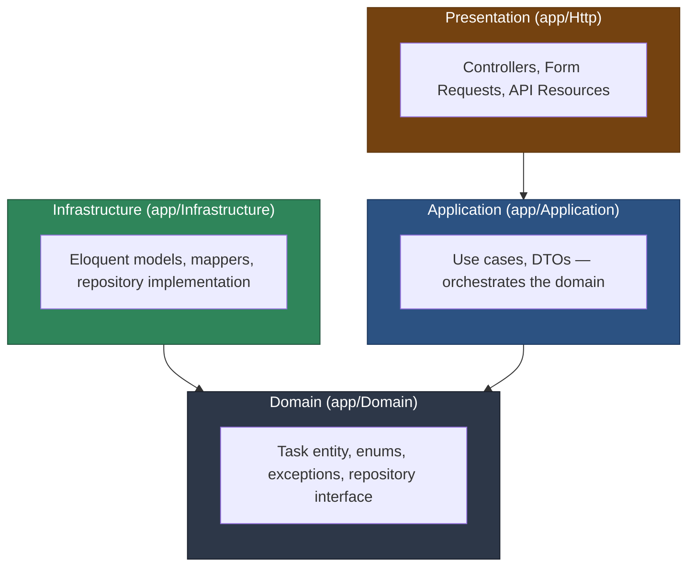

# Task Management API

A small Laravel 11 API built to showcase **Clean Architecture** in a PHP codebase: a framework-agnostic domain and application layer, with Eloquent pushed out to the edges as an implementation detail.

This repository is not meant to showcase a feature-rich product — it is meant to showcase how the code is organized, tested, and verified. The business logic (`app/Domain`, `app/Application`) has zero dependency on Laravel or Eloquent and is covered by tests that never touch a database.

## Table of contents

- [Architecture](#architecture)
- [Tech stack](#tech-stack)
- [Getting started](#getting-started)
- [API endpoints](#api-endpoints)
- [Testing strategy](#testing-strategy)
- [CI/CD pipeline](#cicd-pipeline)
- [Project structure](#project-structure)
- [Known limitations](#known-limitations)

## Architecture

The codebase is split into four layers, each with a single, narrow responsibility. The dependency rule is strict: **an inner layer never depends on an outer layer**. Dependencies always point inward, toward the domain.



Read as plain ASCII, the dependency rule looks like this:

```
Presentation  ──depends on──▶  Application  ──depends on──▶  Domain
Infrastructure ──depends on──▶ Domain
```

Notice that **Domain depends on nothing**. It has no `use Illuminate\...` statement anywhere. Infrastructure depends on Domain only through the `TaskRepositoryInterface` contract — it implements it, it doesn't define it.

### The four layers

| Layer | Path | Responsibility |
|---|---|---|
| **Domain** | `app/Domain/Task` | The `Task` entity (plain PHP, not Eloquent) and its business rules, the `TaskStatus` enum, domain exceptions, and the `TaskRepositoryInterface` contract. This is pure PHP — it could be extracted into its own package without touching a line. |
| **Application** | `app/Application/Task` | Use cases (`CreateTask`, `ListTasks`, `FindTask`, `UpdateTask`, `CompleteTask`, `DeleteTask`) and their DTOs. Each use case is a single invokable class that depends only on `TaskRepositoryInterface` — never on Eloquent. |
| **Infrastructure** | `app/Infrastructure/Persistence/Eloquent` | The actual persistence: `EloquentTask` model, `TaskMapper` (translates between the Eloquent model and the domain `Task` entity), and `EloquentTaskRepository`, which implements `TaskRepositoryInterface`. |
| **Presentation** | `app/Http` | Thin API controllers, Form Requests for input validation, and an API Resource for output shaping. Controllers only inject use cases — they never reference Eloquent. |

The binding between the domain contract and its Eloquent implementation lives in `App\Providers\DomainServiceProvider`, registered in `bootstrap/providers.php`:

```php
$this->app->bind(TaskRepositoryInterface::class, EloquentTaskRepository::class);
```

Swapping persistence (an in-memory store for tests, a different ORM, a remote API) means writing a new class that implements `TaskRepositoryInterface` and changing one line in that provider. Nothing in `Domain` or `Application` would need to change.

### Why this matters in practice

- **The domain entity validates itself.** `Task::create()` and `Task::update()` reject an empty title, a title over 255 characters, and a due date in the past — regardless of which layer called them.
- **Domain exceptions carry HTTP semantics without knowing about HTTP.** `TaskNotFoundException`, `TaskAlreadyCompletedException`, and `InvalidTaskDataException` all extend `\DomainException` and are mapped to 404 / 409 / 422 in a single place — `bootstrap/app.php` — instead of scattered `abort()` calls through the controllers.
- **Use cases are trivially unit-testable.** They depend on an interface, so tests exercise them against a hand-written in-memory repository instead of a database. See [Testing strategy](#testing-strategy).

## Tech stack

- **PHP 8.2+** / **Laravel 11**
- **Pest 3** (`pestphp/pest`, `pestphp/pest-plugin-laravel`) for all testing
- **Larastan / PHPStan** at level 8 for static analysis
- **Laravel Pint** (Laravel preset) for code style
- **SQLite** (`:memory:`) as the test database
- **GitHub Actions** for CI (lint, static analysis, tests with coverage, security)

## Getting started

```bash
git clone https://github.com/WashingtonSteve/projeto-tjsara.git
cd projeto-tjsara

composer install

cp .env.example .env
php artisan key:generate

touch database/database.sqlite
php artisan migrate

php artisan serve
```

The API is now available at `http://localhost:8000/api/tasks`.

### Quick smoke test

```bash
curl -X POST http://localhost:8000/api/tasks \
  -H "Content-Type: application/json" \
  -d '{"title": "Review pull requests", "due_date": "2026-12-01"}'
```

## API endpoints

No authentication — this is a portfolio piece, not a production system.

| Method | URI | Action | Success | Failure |
|---|---|---|---|---|
| `GET` | `/api/tasks` | List every task | `200` | — |
| `POST` | `/api/tasks` | Create a task | `201` | `422` invalid input |
| `GET` | `/api/tasks/{task}` | Show a task | `200` | `404` not found |
| `PUT` | `/api/tasks/{task}` | Update a task | `200` | `404` not found · `422` invalid input |
| `DELETE` | `/api/tasks/{task}` | Delete a task | `204` | `404` not found |
| `POST` | `/api/tasks/{task}/complete` | Mark a task as completed | `200` | `404` not found · `409` already completed |

`POST`/`PUT` payload:

```json
{
  "title": "string, required, max 255",
  "description": "string, optional",
  "due_date": "YYYY-MM-DD, optional, must not be in the past"
}
```

Note the split in where validation happens: **Form Requests** check the HTTP-level shape (is `title` present? is `due_date` a valid date string?), while the **domain entity** enforces the business rule that a due date cannot be in the past. A request with a syntactically valid but business-invalid due date passes the Form Request and is rejected by the domain — both paths return `422`, but only the second one is a `InvalidTaskDataException`. `tests/Feature/Api/TaskApiTest.php` exercises both.

## Testing strategy

Three levels, each isolating a different concern:

```
             ▲
            ╱ ╲        Feature (tests/Feature/Api)
           ╱   ╲       Real HTTP requests, real routing, real SQLite (:memory:).
          ╱─────╲      Confirms the layers are wired together correctly.
         ╱       ╲
        ╱         ╲    Application (tests/Unit/Application)
       ╱           ╲   Each use case against a hand-written in-memory fake of
      ╱             ╲  TaskRepositoryInterface. No Eloquent, no database.
     ╱───────────────╲
    ╱                 ╲ Domain (tests/Unit/Domain)
   ╱                   ╲ The Task entity's business rules in complete isolation.
  ╱_____________________╲ Plain PHP objects — no Laravel bootstrap involved.
```

1. **`tests/Unit/Domain/TaskTest.php`** — tests `Task::create()`, `update()`, and `complete()` directly: title validation, due-date validation, the `TaskAlreadyCompletedException` guard, and that `reconstitute()` (used when rehydrating from persistence) intentionally skips revalidation.
2. **`tests/Unit/Application/*Test.php`** — one file per use case, each run against `Tests\Fakes\InMemoryTaskRepository`, a small hand-written class (not a mocking framework, not a database) that implements `TaskRepositoryInterface` with a PHP array. This is the test suite that proves the application layer doesn't secretly depend on Eloquent.
3. **`tests/Feature/Api/TaskApiTest.php`** — real HTTP requests through the actual routes, actual controllers, and an actual SQLite `:memory:` database via `RefreshDatabase`. Covers the full create/list/show/update/complete/delete cycle plus the `404` / `409` / `422` error paths.

Run everything:

```bash
php artisan test
# or
vendor/bin/pest
```

## CI/CD pipeline

`.github/workflows/ci.yml` runs on every `push` and `pull_request`, as four independent jobs. Each one is a specific gate — this is what each is there to stop from reaching `main`:

| Job | Command | Blocks |
|---|---|---|
| **lint** | `vendor/bin/pint --test` | Inconsistent formatting from ever being reviewed or merged — Pint auto-fixes locally, CI only checks. |
| **static-analysis** | `vendor/bin/phpstan analyse` (Larastan, level 8) | Type errors, impossible conditions, and incorrect use of Eloquent/Laravel APIs that unit tests might not happen to cover. |
| **tests** | `vendor/bin/pest --coverage` | Behavioral regressions in the domain, application, or HTTP layer. Coverage is captured with `pcov` and uploaded as a build artifact on every run. |
| **security** | `composer audit` + `gitleaks` | Dependencies with known CVEs, and secrets (API keys, credentials) accidentally committed to the repository. |

All four jobs must pass before a pull request should be mergeable. Since GitHub Actions alone doesn't enforce that, **branch protection on `main` should require all four status checks** (Settings → Branches → Branch protection rules → Require status checks to pass before merging). This repository doesn't set that from code — it's a one-time setting an admin configures.

## Project structure

```
app/
├── Domain/Task/                         # Framework-agnostic business rules
│   ├── Entities/Task.php
│   ├── Enums/TaskStatus.php
│   ├── Exceptions/
│   └── Repositories/TaskRepositoryInterface.php
├── Application/Task/                    # Use cases orchestrating the domain
│   ├── DataTransferObjects/
│   └── UseCases/
├── Infrastructure/Persistence/Eloquent/ # Eloquent is an implementation detail
│   ├── Models/EloquentTask.php
│   ├── Mappers/TaskMapper.php
│   └── Repositories/EloquentTaskRepository.php
├── Http/                                # Thin controllers, Form Requests, Resources
│   ├── Controllers/Api/TaskController.php
│   ├── Requests/
│   └── Resources/TaskResource.php
└── Providers/DomainServiceProvider.php  # Binds the domain contract to Eloquent

database/
├── migrations/..._create_tasks_table.php
└── factories/EloquentTaskFactory.php

tests/
├── Unit/Domain/TaskTest.php
├── Unit/Application/*Test.php
├── Fakes/InMemoryTaskRepository.php     # Hand-written double, not a mock
└── Feature/Api/TaskApiTest.php
```

## Known limitations

- **Upstream security advisories on `laravel/framework`.** `composer audit` ignores three advisories (documented with reasons in `composer.json` → `config.audit.ignore`) that affect every Laravel 11.x release because their fixes were only backported to the 12.x/13.x branches. They're low/medium severity (a debug-page XSS only reachable with `APP_DEBUG=true`, a signed-URL edge case, and a CRLF edge case in the default email validation rule) and are tracked, not silently hidden — `composer audit` output still shows them as "ignored," not absent.
- **No `--min` coverage gate in CI.** Coverage is captured and uploaded on every run, but no minimum threshold is enforced yet. Worth adding once a baseline is established.

## License

MIT — see [LICENSE](LICENSE).
